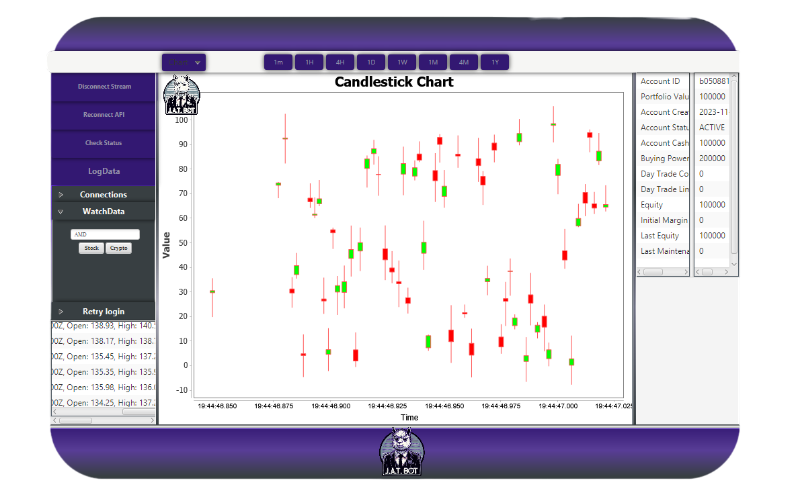

  

<h1 align="center">JATBot - Java Algorithmic Trading Platform</h1>

<b>Real-time trading intelligence. AI-driven forecasts. Built for performance, flexibility, and future growth.</b>

---

## 🚀 Overview

**JATBot** is a modern algorithmic trading platform built in Java, designed to analyze markets, forecast asset movements, and execute trades with speed and precision. It connects seamlessly to live data and brokerage services via the **Alpaca API**, and leverages **XGBoost** for AI-powered market predictions. With a responsive JavaFX interface and scalable architecture, JATBot is built for serious traders and forward-thinking developers alike.

> 💡 *Development started: November 28, 2023 · Status: Pre-Deployment Testing*

---

## 🎯 Key Features

- 📈 **Live Market Data**  
  Real-time trading data via Alpaca API for up-to-date decision making.

- 🤖 **AI-Powered Predictions**  
  Accurate market direction forecasting powered by XGBoost machine learning.

- 🧪 **Custom Backtesting Engine**  
  Simulate historical trades to evaluate strategy profitability before deploying.

- 🎨 **User-Friendly Desktop App**  
  Fast, clean JavaFX interface with intuitive visual feedback.

- 🔒 **Risk Protection Tools**  
  Built-in stop-loss, take-profit, and signal-based protection for capital preservation.

- 🌱 **Expandable System Design**  
  Built to support future AI models, brokers, and trading strategies.

- 🌐 **Cloud-Ready Web Version (In Progress)**  
  Spring WebFlux version being developed for online access and mobile platforms.
---

## 🧰 Tech Stack

| Layer             | Tools/Technologies                                     |
|-------------------|--------------------------------------------------------|
| Language          | Java (JDK 21)                                          |
| Frontend          | JavaFX, SceneBuilder, CSS                              |
| Backend           | Spring Boot, Spring WebFlux (WIP), R2DBC               |
| Machine Learning  | XGBoost                                                |
| Database          | PostgreSQL with R2DBC                                  |
| Build System      | Maven                                                  |
| Logging           | SLF4J                                                  |
| Version Control   | Git, GitHub                                            |
| Hosting (Planned) | IBM Cloud or AWS                                       |
---

## 📷 UI Screenshots

  
  
  
  

---

## 🛠️ Setup Instructions

Release unavailable, please wait for further development.

---

## 📅 Development Roadmap (High-Level)

| Stage | Milestone |
|-------|-----------|
| ✅ 1. | Environment & Dependency Setup (JavaFX, Maven, Alpaca API) |
| ✅ 2. | Alpaca API Integration (auth, historical + real-time data) |
| ✅ 3. | JavaFX UI (dashboards, login, responsive interaction) |
| ✅ 4. | Deep Learning integration (DL4J model for prediction) |
| ✅ 5. | Trading Strategies (divergence detection, risk logic) |
| ✅ 6. | Backtesting Engine & Performance Metrics |
| ⏳ 7. | Deployment (cloud server or local, logging, scaling) |
| ⏳ 8. | Documentation, Testing, Open Alpha |

> Full roadmap is available in `DEVELOPMENT.md`.

---

## ⚠️ Disclaimer

> **This project is under development and not intended for production or financial use.**  
> Any use of this tool for live trading is at your own risk. We recommend consulting a licensed financial advisor before using algorithmic trading systems.

---

## 🙌 Contributions & Contact

If you're interested in contributing to JATBot, feel free to fork the repo or reach out:

- 📧 aidankorczynskibusy@gmail.com  
- 💼 [LinkedIn](https://www.linkedin.com/in/aidan-korczynski/)  
- 💻 [Portfolio & Other Projects](https://github.com/chokinski)

---

## 📘 License

MIT License (TBD — currently private use)