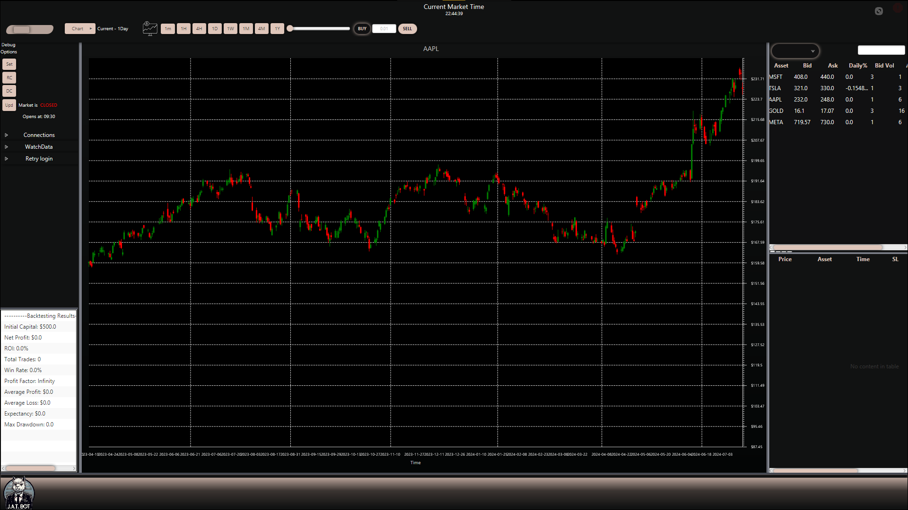

> This is the Pre-Deployment Main Branch. Please note development may halt or be painstakingly slow. As such, do not attempt to use this program in it's current state until further notice.

  

<h1 align="center" style="color:#FFC66D;">Java Algorithmic Trading Bot</h1>

This project is a **Java-based algorithmic trading bot** with development officially beginning on **November 28th, 2023**. This bot will be capable of using various strategies and algorithms to make trading decisions. The bot will adhere to strict or lenient risk management tools based on the user's implementation.

<h1 align="center" style="color:#CC7832;">DISCLAIMER</h1>

> **Please be aware** that the use of our Java Algorithmic Trading Bot is at your own discretion and risk. The developers are not to be held responsible for ANY loss of money or assets that hold real-world cash value resulting from the use of this tool. It is strongly recommended that you understand the risks involved with algorithmic trading and use this bot responsibly. If you aren't knowledgeable in trading, we advise you seek help from an accredited financial adviser prior so you understand how to use our bot effectively and safely.

<h2 align="center" style="color:#CC7832;">Dependencies</h2>

The project uses the following dependencies:

- **Alpaca API**: For interacting with the Alpaca trading platform.
- **Okio**: A modern I/O library for Android and Java.
- **Gson**: A Java library for converting Java Objects into their JSON representation and vice versa.
- **JavaFX**: A graphics and media package for creating rich client applications.
- **SLF4J Simple**: A simple implementation of SLF4J API used for testing, development, and logging in this project.

Please refer to the `.classpath` file for the specific versions of these dependencies.

<h2 align="center">Setup</h2>

**JRE 21** may be needed. You will also need to modify the `alpaca.properties` file with your **Alpaca API credentials**.

## Usage

  
  
  

*To be completed*

<h2 align="center">Development Roadmap</h2>

### Stage 1: Environment Setup and Dependencies
#### Java Development Kit (JDK):
- **Sub-Stage 1.1:** Install the latest version of JDK compatible with your project requirements.
- **Sub-Stage 1.2:** Set the JAVA_HOME environment variable to the JDK installation path.

#### Integrated Development Environment (IDE):
- **Sub-Stage 1.3:** Install a Java IDE such as Visual Studio Code or IntelliJ IDEA.

#### Build Tool:
- **Sub-Stage 1.4:** Choose a build tool (Maven or Gradle) for dependency management and building the project.

#### JavaFX Library:
- **Sub-Stage 1.5:** Add JavaFX as a dependency in your project configuration file (pom.xml or build.gradle).
- **Sub-Stage 1.6:** Set up the project to use JavaFX by configuring the module-info.java file (if using Java 9 or later).

#### Alpaca API Dependency:
- **Sub-Stage 1.7:** Integrate the alpaca-java library into your project using Maven or Gradle.
- **Sub-Stage 1.8:** Confirm the library version is compatible with your Java version.
- **Sub-Stage 1.9:** Ensure proper dependency resolution during the build process.

#### Logging with SLF4J:
- **Sub-Stage 1.10:** Add SLF4J as a dependency in your project.
- **Sub-Stage 1.11:** Choose a logging implementation (e.g., Logback) and add it as a dependency.
- **Sub-Stage 1.12:** Configure the logging implementation with an appropriate configuration file.

### Stage 2: Alpaca API Integration
#### Alpaca Account Setup:
- **Sub-Stage 2.1:** Create an account on the Alpaca platform.
- **Sub-Stage 2.2:** Obtain an API key and secret for authentication.

#### API Connection and Configuration:
- **Sub-Stage 2.3:** Implement Java code to connect to the Alpaca API using HTTP requests.
- **Sub-Stage 2.4:** Load API credentials securely from a configuration file or environment variables.

#### Data Retrieval:
- **Sub-Stage 2.5:** Retrieve historical price data for the selected trading pairs or stocks.
- **Sub-Stage 2.6:** Implement real-time data streaming for live market updates.

### Stage 3: JavaFX UI Implementation (Optional)
#### JavaFX Setup:
- **Sub-Stage 3.1:** Create a new JavaFX project in your IDE.
- **Sub-Stage 3.2:** Set up the project structure with appropriate packages.

#### Main UI Components:
- **Sub-Stage 3.3:** Design and implement the main components of your JavaFX UI.
- **Sub-Stage 3.4:** Ensure responsiveness and user-friendly interactions.

#### Integration with Trading Logic:
- **Sub-Stage 3.5:** Integrate the JavaFX UI with the trading logic.
- **Sub-Stage 3.6:** Implement event handling for user inputs and actions.

### Stage 4: Deep Learning Integration (Optional)
#### Deep Learning Library Selection:
- **Sub-Stage 4.1:** Choose a deep learning library/framework (e.g., TensorFlow, PyTorch).

#### Model Architecture:
- **Sub-Stage 4.2:** Design a neural network architecture suitable for your trading strategy.
- **Sub-Stage 4.3:** Implement the model using the chosen deep learning library.

#### Training:
- **Sub-Stage 4.4:** Train the model using historical market data.

### Stage 5: Trading Strategy Implementation
#### Divergence Detection:
- **Sub-Stage 5.1:** Implement feature engineering techniques for detecting hidden divergences and divergences.
- **Sub-Stage 5.2:** Code algorithms to identify trading signals based on divergence patterns.

#### Risk Management:
- **Sub-Stage 5.3:** Implement stop-loss and take-profit logic based on risk management principles.
- **Sub-Stage 5.4:** Develop a position sizing strategy to manage capital allocation.

### Stage 6: Backtesting and Performance Evaluation
#### Historical Simulation:
- **Sub-Stage 6.1:** Create a backtesting framework to simulate trades using historical data.
- **Sub-Stage 6.2:** Implement performance metrics to evaluate the strategy.

#### Optimization and Refinement:
- **Sub-Stage 6.3:** Iteratively refine the trading strategy based on backtesting results.
- **Sub-Stage 6.4:** Ensure adaptability to changing market conditions.

### Stage 7: Deployment and Continuous Monitoring
#### Deployment:
- **Sub-Stage 7.1:** Decide whether to deploy the bot on a cloud server or a local machine.
- **Sub-Stage 7.2:** Set up continuous monitoring and logging for debugging and analysis.

#### Integration with Broker API (Optional):
- **Sub-Stage 7.3:** If ready, integrate the trading bot with the Alpaca live trading API.

### Stage 8: Documentation and Testing
